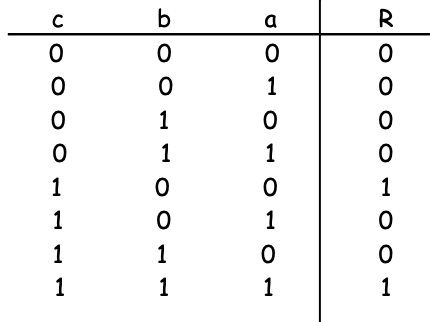
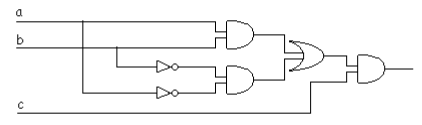

### FIT - Universidad Católica del Uruguay

 

# Compuertas Lógicas

## 🤯 Problema 

Tu mejor amigo esta cursando la carrera de Ingeniería en electronica en la UCU, como sabe que tu haces informática pide tu ayuda para que desarrolles un programa que le permita de manera rápida evaluar el resultado de un circuito basado compuertas lógicas. Para apoyarte en la solución del problema tu amigo te comparte el siguiente [repositorio](https://github.com/ucudal/PII_PythonToCSharp_Compuertas) donde tiene una implementación en python 🐍 de parte del problema.

### Consideraciones

* Para este problema tu amigo te pide que  modeles las tres compuertas lógicas básicas And, Or, Not.

* Recuerda que hay que compuertas las que deben tener al menos dos entradas para poder ser utilizada.

* Ten en cuenta que las compuertas pueden ser conectables unas con otras, es decir en la entrada cada compuerta debemos tener un valor lógico bien como resultado de la evaluación parcial del circuito que precede a la compuerta o bien por la presencia del valor directo. 

## 🏋️‍♀️ Desafío

### Parte 1: Diseño
Construye el diagrama de clases de la solución.

### Parte 2: Implementación
Crea la estructura de proyecto(C#) que corresponda y desarrolla el programa utilizando los conceptos que hemos visto hasta el momento (esto incluye patrones y principios).

### Parte 3: Validación
Escribe los casos de prueba para las compuertas implementadas, puedes y debes apoyarte en las tablas de verdad para cada una de las compuertas lógicas.

### Parte 4: El Garage 
Tu amigo luego de un tiempo vuelve a pedirte ayuda, en esta ocasión para utilizar tu programa en la resolución de un ejercicio un poco mas complejo, el ejercicio dice así...

Imagina que tienes que diseñar una puerta electrónica para un garaje, de forma que solo debe abrirse cuando se pulse una determinada combinación de botones (A, B y C ), según las condiciones indicadas. Diseña el circuito lógico que permita la apertura de la puerta del garaje, empleando las puertas lógicas que consideres oportuno.
Condiciones de apertura: 
* C pulsado, A y B en reposo.
* A, B y C pulsados.

Para Comenzar a darle solución al problema tu amigo realizo el diseño del circuito y la tabla de verdad para el mismo.

Para poder ayudarlo tu deberás:

* Implementar la clase GarageGate utilizando las abstracciones antes definidas.
* Realizar los casos de prueba que valide el correcto funcionamiento de la puerta.

### ☘️ Mucha suerte !

